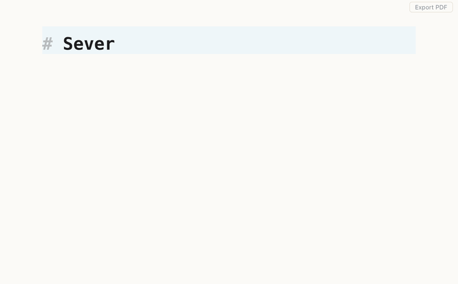

# Foglio 

[](https://github.com/fran-mora/foglio/actions/workflows/test.yml)

A markdown editor for macOS. Text renders as you type, in the pane you are editing, so there is no split view and no preview mode to switch into. *Foglio* is Italian for a sheet of paper.



## Why

Typora set the pattern for this kind of editing and is closed source. Mark Text, the open-source answer, is Electron and sat unmaintained from 2022 until this year. MarkEdit is native and quick but shows plain source with no rendering.

Foglio is the small open-source version. The app is 6.6 MB, starts with a document on screen in about a quarter of a second, and never rewrites your markdown into something else.

That last part is the real difference. Editors built on ProseMirror or TipTap parse your file into a document model and generate markdown back out of it, which is where list markers, emphasis characters and blank lines quietly change. Foglio decorates the source text instead, so what it writes is what you wrote. Press ⇧⌘D before saving and you can watch the diff to see for yourself.

## What it does

- **Renders inline.** Headings, bold, italic, links, tables, task lists, quotes, images and fenced code all render in place. Put the cursor on a line and the raw markdown comes back so you can edit it.
- **Highlights code** in fenced blocks, for the 143 languages CodeMirror ships grammars for.
- **Toggles task lists on click.** The checkbox writes `[x]` back into the file.
- **Shows images** from relative or absolute paths, scaling one that sits inside a sentence to the line height so the text still reads.
- **Opens from Finder.** Double-click any `.md`, `.markdown` or `.mdx` file. Opening a file that is already open focuses its window rather than opening a second copy of it.
- **Follows the file on disk.** Change the document in another tool and Foglio reloads it, asking first if you have unsaved edits. It handles atomic-rename saves, the kind Dropbox and many editors do.
- **Behaves like a Mac app.** Native menu bar, multiple windows, save prompts on close and on ⌘Q, find with ⌘F, zoom with ⌘+ and ⌘−.
- **Exports to PDF** by rendering to HTML and handing off to your browser, where ⌘P saves a PDF.
- **Renders math** with KaTeX, `$inline$` and `$$display$$`. A price like $5 stays a price.
- **Draws Mermaid diagrams** from ```` ```mermaid ```` fences. The library loads only when a document contains one.
- **Folds YAML frontmatter** into a key/value summary, and gives back the raw YAML when you put the cursor in it.
- **Shows what would change on disk** with ⇧⌘D, before you save.
- **Reads .editorconfig** for line endings, final newline and trailing whitespace. Trailing whitespace is left alone when the document uses two-space hard line breaks.

## Install

Download the dmg from [Releases](../../releases). It is signed and notarized by Apple, so it opens without a Gatekeeper warning.

Or build it yourself:

```sh
npm install
npm run tauri build
```

That needs Node.js and a Rust toolchain ([rustup](https://rustup.rs)). Use `npm run tauri dev` while working on it.

Requires macOS 11 or later, on Apple Silicon or Intel. The window chrome and Finder integration use macOS APIs, so there is no Windows or Linux build.

## Keys

| Key | Action |
|-----|--------|
| ⌘O | Open |
| ⌘S | Save |
| ⇧⌘S | Save As |
| ⌘N | New window |
| ⌘P | Export as PDF |
| ⌘F | Find |
| ⇧⌘D | Show what would change on disk |
| ⌘+ ⌘− ⌘0 | Zoom in, out, reset |

## Roadmap

Left out on purpose: themes, plugins, auto-update, and Windows or Linux builds. Foglio is meant to stay small.

## Tests

```sh
npm test                                          # tests/
cargo test --manifest-path src-tauri/Cargo.toml   # src-tauri/src/lib.rs
```

They cover the code where a wrong answer would pass unnoticed. That means the
HTML escaping standing between a document and script running in the editor,
which link targets a document may point at, table, image, frontmatter and math
parsing, how a relative image path resolves against the open file, that loading
a document leaves nothing in undo history, that line endings survive a
round trip, and how a document name is sanitised before it goes into a temp
path.

They do not check how any of it looks. Rendering is verified by running the app
and reading the screen. Every bug found here so far has been a visual one, such
as a marker reflowing the line under the cursor, or a selection drawn behind an
opaque background, and no assertion would have caught either.

## Debugging

Run with `MD_DEBUG=1` to write a log to `$TMPDIR/foglio-debug.log`.

## Status

A personal project, shared as-is. Issues and pull requests are welcome, but no support or delivery date is promised.

Written with [Claude Code](https://claude.com/claude-code) and [Codex](https://openai.com/codex).

## License

[MIT](LICENSE)
