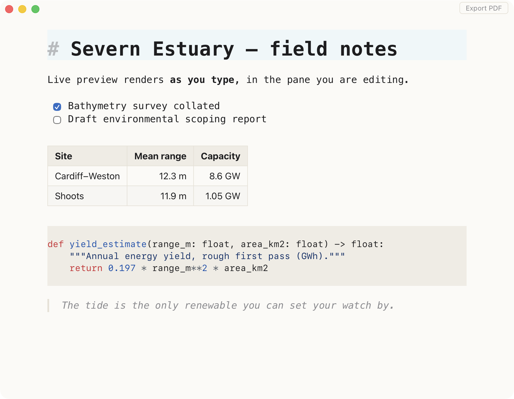

# Foglio

A markdown editor for macOS. Text renders as you type, in the pane you are editing, so there is no split view and no preview mode to switch into. *Foglio* is Italian for a sheet of paper.



## Why

Typora set the pattern for this kind of editing and is closed source. Mark Text, the open-source answer, is Electron and sat unmaintained from 2022 until this year. MarkEdit is native and quick but shows plain source with no rendering.

Foglio is the small open-source version. The app is 5 MB, starts with a document on screen in under half a second, and never rewrites your markdown into something else.

## What it does

- **Renders inline.** Headings, bold, italic, links, tables, task lists, quotes, images and fenced code all render in place. Put the cursor on a line and the raw markdown comes back so you can edit it.
- **Highlights code** in fenced blocks, for the 143 languages CodeMirror ships grammars for.
- **Toggles task lists on click.** The checkbox writes `[x]` back into the file.
- **Shows images** from relative or absolute paths. An image sitting inside a sentence is scaled to the line so the text still reads.
- **Opens from Finder.** Double-click any `.md`, `.markdown` or `.mdx` file. Opening a file that is already open focuses its window rather than opening a second copy of it.
- **Follows the file on disk.** Change the document in another tool and Foglio reloads it, asking first if you have unsaved edits. Atomic-rename saves, the kind Dropbox and many editors do, are handled.
- **Behaves like a Mac app.** Native menu bar, multiple windows, save prompts on close and on ⌘Q, find with ⌘F, zoom with ⌘+ and ⌘−.
- **Exports to PDF** by rendering to HTML and handing off to your browser, where ⌘P saves a PDF.

## Install

Download the dmg from [Releases](../../releases), or build it yourself:

```sh
npm install
npm run tauri build
```

That needs Node.js and a Rust toolchain ([rustup](https://rustup.rs)). Use `npm run tauri dev` while working on it.

Requires macOS 11 or later. The window chrome and Finder integration use macOS APIs, so there is no Windows or Linux build.

## Keys

| Key | Action |
|-----|--------|
| ⌘O | Open |
| ⌘S | Save |
| ⇧⌘S | Save As |
| ⌘N | New window |
| ⌘P | Export as PDF |
| ⌘F | Find |
| ⌘+ ⌘− ⌘0 | Zoom in, out, reset |

## Roadmap

Left out of 0.1 on purpose: math typesetting, Mermaid diagrams, themes, plugins, auto-update, and Windows or Linux builds. Foglio is meant to stay small. Math and Mermaid are the likeliest things to add next.

## Debugging

Run with `MD_DEBUG=1` to write a log to `$TMPDIR/foglio-debug.log`.

## Status

A personal project, shared as-is. Issues and pull requests are welcome, but no support or delivery date is promised.

## License

[MIT](LICENSE)
